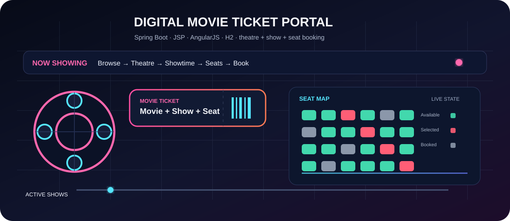
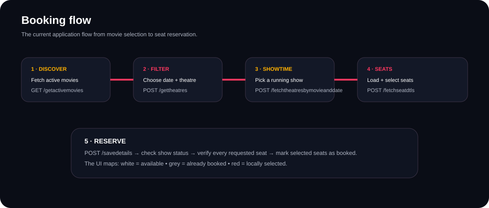
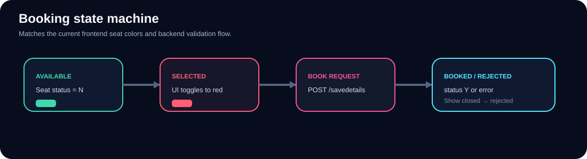
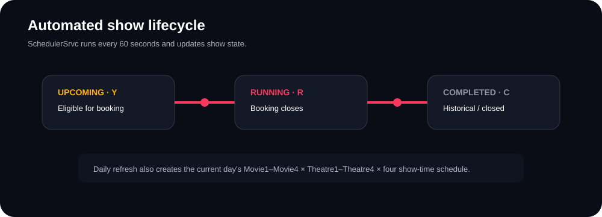
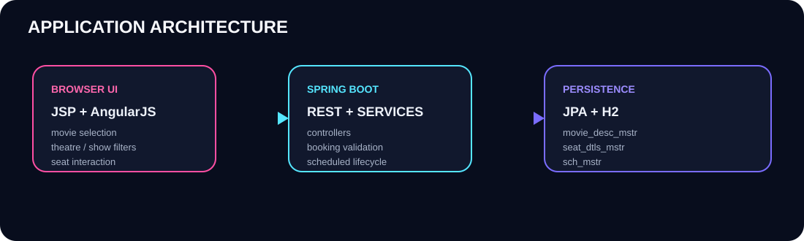

<p align="center">
  
</p>

<p align="center">
  
  
  
  
  
  
</p>

<p align="center">
  <a href="https://github.com/Sai-Srinivas-P/DIGITAL-MOVIE-TICKET-PORTAL">
    
  </a>
  
  
  
  
  
</p>

<h1 align="center">Digital Movie Ticket Portal</h1>

<p align="center">
  A compact Java full-stack movie booking prototype with show scheduling, theatre filtering, seat availability, and booking validation.
</p>

<p align="center">
  
</p>

## 🎬 What this project actually is

The repository is a **Spring Boot 2.7.3 + Java 17** web application backed by **H2** and served through a JSP page. The browser UI uses **AngularJS 1.6.9**, Bootstrap, jQuery, and a small custom stylesheet.

The previous README described the frontend as ReactJS, but **there is no React application in this repository**. The shipped UI is:

- `src/main/webapp/templates/index.jsp`
- `src/main/webapp/js/Booking.js`
- `src/main/webapp/css/stylesheet.css`

That distinction is important for anyone cloning and running the project.

<p align="center">
  
</p>

<details>
<summary><strong>🎟️ See the booking journey at a glance</strong></summary>

```text
Movie → Date → Theatre → Show → Seats → Booking validation → Seat status update
```

</details>

## 🍿 Core experience

The application follows a straightforward booking journey:

1. Load the list of active movies.
2. Pick a date.
3. Filter available theatres.
4. Choose a show time.
5. Load the show's seat map.
6. Select available seats.
7. Submit the reservation.
8. Reject the booking when the show is no longer bookable or a requested seat has already been reserved.

The browser uses these backend endpoints:

| Endpoint | Method | Purpose |
|---|---|---|
| `/getactivemovies` | GET | Return active movie names |
| `/gettheatres` | POST | Find theatres for a movie/date/time |
| `/fetchtheatresbymovieanddate` | POST | Return show records for a selected theatre |
| `/fetchseatdtls` | POST | Load seat status for a selected show |
| `/savedetails` | POST | Validate and reserve selected seats |

## 🎟️ Seat booking

The current UI represents seats using simple color states:

- **White** → available
- **Grey** → already booked
- **Red** → selected by the current user

The frontend lays seats out in rows of **7** and lets the user toggle an available seat between white and red.

On submission, the service checks the show status first, then checks every requested seat before saving the updated seat statuses.

> **Important limitation:** this is a prototype booking flow, not a transactional ticketing platform. There is no payment integration, authentication layer, booking-history model, ticket entity, or concurrency/locking strategy for simultaneous requests.

## ⏱️ Automated show lifecycle



`SchedulerSrvc` is annotated with `@EnableScheduling` and executes every **60 seconds**.

The scheduler:

- seeds the current day's schedule when the stored date changes;
- creates four movie names: `Movie1` through `Movie4`;
- creates four theatres: `Theatre1` through `Theatre4`;
- creates four show start times: `09:00:00`, `13:00:00`, `19:00:00`, `22:00:00`;
- assigns a default of **25 seats per generated show**;
- initializes missing seat records;
- marks shows as running or completed based on the current date/time.

The repository also contains a seeded `Movie5` / `Theatre5` record in `data.sql` with a small **15-seat** layout for initial database content.

<p align="center">
  
</p>

## 🏗️ Architecture

```text
Browser
  │
  │ AngularJS + JSP + Bootstrap
  ▼
HomeController / REST Controllers
  │
  ▼
TicketBookingSrvcImpl
  │
  ├──────────────┐
  ▼              ▼
MovieDescRepo   SeatDtlsRepo
  │              │
  └───────┬──────┘
          ▼
       H2 Database
          ▲
          │
     SchedulerSrvc
```

### Main layers

| Layer | Current implementation |
|---|---|
| Web/UI | JSP + AngularJS 1.6.9 + Bootstrap + jQuery |
| Controllers | Spring MVC / REST controllers |
| Service | `TicketBookingSrvcImpl` |
| Persistence | Spring Data JPA repositories |
| Database | H2 in-memory database |
| Scheduling | Spring `@Scheduled(fixedDelay = 60000)` |
| Build | Maven Wrapper |

## 🧩 Data model

The main persisted structures are intentionally small:

```text
movie_desc_mstr
├── Id
├── Moviename
├── Theatrename
├── Startdate / Starttime
├── Enddate / Endtime
├── Seats
└── Status

seat_dtls_mstr
├── Id
├── Moviedescid
├── Seatno
└── Status

sch_mstr
├── id
└── ldate
```

A show record in `movie_desc_mstr` is associated with its seats through `Moviedescid`.

There is no separate customer, booking, payment, or ticket table in the current schema.

## 🛠️ Technology stack

### Backend

- Java 17
- Spring Boot 2.7.3
- Spring Web
- Spring Data JPA
- Spring JDBC
- Spring Scheduling
- H2
- Apache Tomcat Jasper
- PostgreSQL driver included as a runtime dependency
- Spring Mail dependency included
- iText / XMLWorker dependencies
- Apache Commons CSV
- Apache Velocity

### Frontend

- JSP
- AngularJS 1.6.9
- Bootstrap
- jQuery
- Font Awesome
- Vanilla JavaScript

### Build & tooling

- Maven Wrapper
- JUnit 5 / Spring Boot Test
- Git

## 📁 Repository structure

```text
DIGITAL-MOVIE-TICKET-PORTAL/
├── pom.xml
├── mvnw
├── mvnw.cmd
├── LICENSE.md
├── README.md
├── assets/
│   ├── movie-portal-hero.svg
│   ├── booking-flow.svg
│   └── show-lifecycle.svg
└── src/
    ├── main/
    │   ├── java/com/portal/movieticketbooking/
    │   │   ├── controller/
    │   │   ├── model/
    │   │   ├── pojo/
    │   │   ├── repository/
    │   │   └── service/
    │   ├── resources/
    │   │   ├── application.properties
    │   │   └── data.sql
    │   └── webapp/
    │       ├── css/stylesheet.css
    │       ├── js/Booking.js
    │       └── templates/index.jsp
    └── test/
        └── java/com/portal/movieticketbooking/
            └── MovieticketbookingApplicationTests.java
```

## 🚀 Run it locally

### Prerequisites

- **JDK 17**
- Git
- A terminal or IDE that can run Maven projects

The repository includes Maven Wrapper scripts, so a separate Maven installation is optional.

### 1. Clone

```bash
git clone https://github.com/Sai-Srinivas-P/DIGITAL-MOVIE-TICKET-PORTAL.git
cd DIGITAL-MOVIE-TICKET-PORTAL
```

### 2. Start the application

Linux / macOS:

```bash
./mvnw spring-boot:run
```

Windows:

```bat
mvnw.cmd spring-boot:run
```

Or run `MovieticketbookingApplication.java` from your IDE.

### 3. Open the application

The controller exposes the main page through:

```text
/home
```

Depending on your local Spring Boot port, open:

```text
http://localhost:8080/home
```

The project uses an **in-memory H2** database, configured in `src/main/resources/application.properties`.

## 🗄️ Database configuration

Current configuration:

```properties
spring.h2.console.enabled=true
spring.datasource.platform=h2
spring.datasource.url=jdbc:h2:mem:aniket
spring.jpa.defer-datasource-initialization=true
```

Because this is an in-memory database:

- data disappears when the application stops;
- `data.sql` seeds the initial records;
- the scheduler creates and refreshes daily show data in memory.

For a durable deployment, the application would need a persistent database configuration and a migration strategy.

## 🧪 Testing

The repository currently contains one Spring Boot context test:

```bash
./mvnw test
```

The test class is:

`src/test/java/com/portal/movieticketbooking/MovieticketbookingApplicationTests.java`

It currently verifies that the Spring application context loads successfully.

That is **not** a full booking test suite. There are no repository-level, controller-level, seat-concurrency, or end-to-end booking tests in the repository.

## 🔐 What is missing from a production booking system

The largest gap is not the UI. It is the transaction model.

The current `savedetails()` flow checks seat status and then writes updates, but the repository does not show a proper transaction/locking strategy for two users attempting to reserve the same seat at the same time.

For a production-ready system, the next engineering priorities would be:

- authenticated user accounts;
- persistent booking and ticket entities;
- database transactions and row-level locking;
- payment integration;
- booking cancellation/refund flow;
- email/SMS ticket delivery;
- server-side request validation;
- database migrations;
- API error contracts;
- proper automated tests;
- external configuration for secrets and database credentials;
- a modern frontend separated from the JSP layer.

## 📈 Sensible upgrade path

```text
Current prototype
      │
      ▼
Extract service + DTO contracts
      │
      ▼
Add Booking / Customer / Ticket entities
      │
      ▼
Transactional seat reservation
      │
      ▼
Persistent PostgreSQL / MySQL database
      │
      ▼
Authentication + payments
      │
      ▼
Modern frontend + deployment pipeline
```

That path preserves the useful booking logic while fixing the parts that currently prevent this from being a robust ticketing platform.

## 🤝 Contributing

Keep changes focused and include tests for behavior that affects booking, seat state, scheduling, or API responses.

For larger changes, document the data-model or endpoint impact in the pull request.

## 📜 License

This project is licensed under the **MIT License**. See [`LICENSE.md`](LICENSE.md).

## 👤 Author

**Sai-Srinivas-P**  
GitHub: <https://github.com/Sai-Srinivas-P>

---

<p align="center">
  <sub>Documentation rebuilt around the code, data model, frontend assets, and scheduler actually present in this repository.</sub>
</p>
